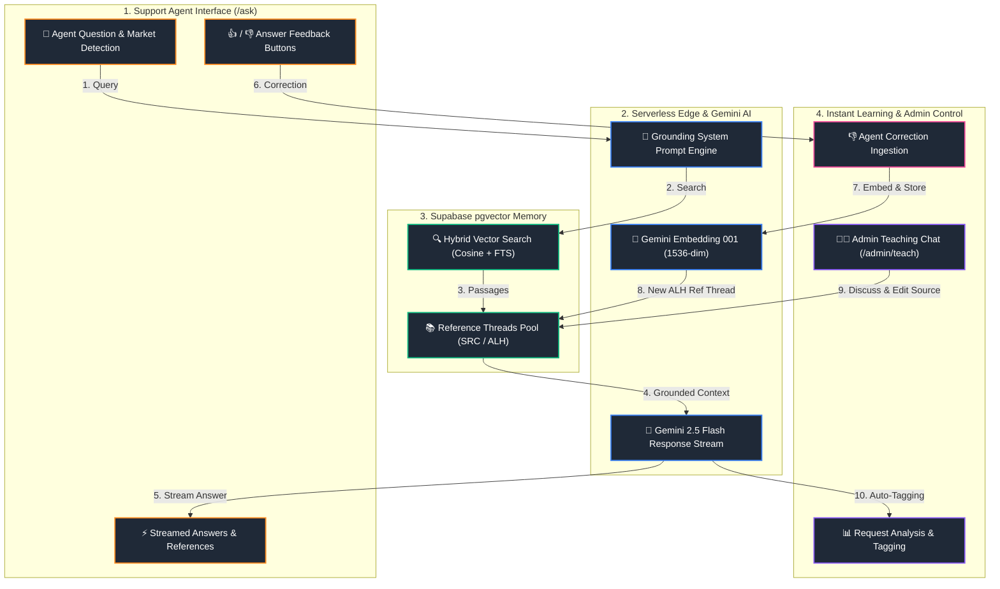
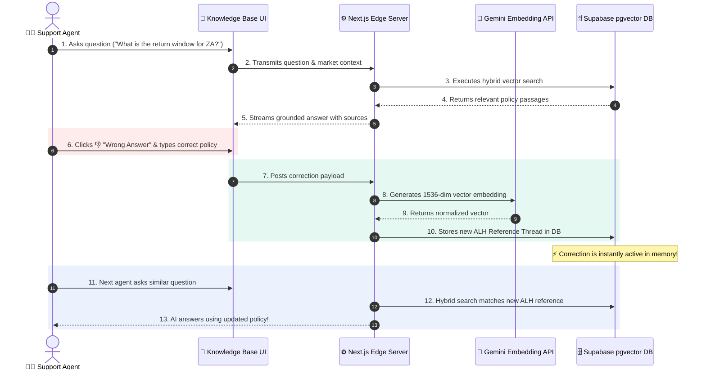
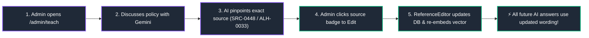
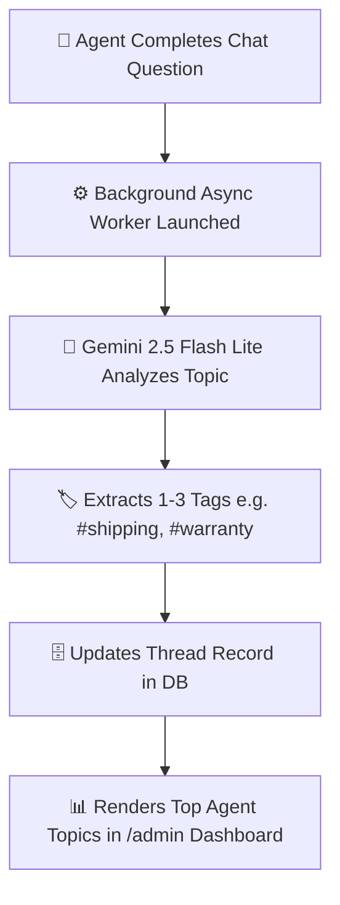

# How the Revibe Knowledge Base AI Learns

## 🎯 Executive Overview
Traditional AI systems require expensive model re-training that takes days or weeks. 

The Revibe Knowledge Base uses an **Instant RAG Reinforcement Architecture**. It learns **in real-time** from two sources:
1. **Support Agents** giving live feedback on answers.
2. **Managers & Admins** updating policies directly through conversational teaching or document editing.

Everything takes effect in **seconds**, costs **$0 in training fees**, and leaves a **100% traceable audit log**.

---

## 🏗️ 1. System Architecture Overview

---

## 🔄 2. Learning Loop 1: Agent Feedback & Auto-Correction

### Step-by-Step Breakdown:
1. **Agent Asks a Question**: An agent searches for a policy on `/ask`.
2. **Agent Flags an Inaccurate Answer**: If the AI's response is outdated or incomplete, the agent clicks **👎 Wrong Answer**.
3. **Mandatory Correction Input**: An input box appears: *"What is the correct policy?"*. The agent types the accurate rule (e.g., *"ZA return window is 14 days, not 7 days"*).
4. **Instant Ingestion & Vector Embedding**:
   - The backend converts the correction into a new **Reference Thread** tagged `ALH`.
   - It runs Gemini's embedding model (`gemini-embedding-001`) to convert the correction text into a 1536-dimensional vector.
   - The vector is stored in Supabase's `pgvector` database.
5. **Instant Knowledge Propagation**:
   - The very next time **any agent** across the team asks about ZA return windows, the hybrid search engine (`hybridSearch`) matches the newly created reference thread.
   - The AI uses the corrected policy in its response. **Zero delay, zero re-training.**

---

## 👩‍🏫 3. Learning Loop 2: Admin Conversational Teaching (`/admin/teach`)

Admins don't need to write code or run database scripts to update the AI. They can **teach it conversationally**:

1. **Admin Discusses Policy**: Open `/admin/teach` and type: *"Where do we state the Saudi shipping SLA?"*.
2. **AI Locates Sources**: The AI identifies the exact underlying documents (e.g. `SRC-0448` or `ALH-0033`) and quotes the text verbatim.
3. **Admin Instructs Edit**: Admin types: *"Update SA shipping to 2-3 business days"*.
4. **In-Place Database Re-Embedding**: 
   - Clicking the source badge opens the `ReferenceEditor`.
   - Saving the text automatically re-calculates the vector embedding and updates the database.
   - Future AI queries instantly pull the revised policy.

---

## 🏷️ 4. Learning Loop 3: Automatic Request Categorization & Tagging

To help management understand what agents are struggling with, the system performs **Background Topic Analysis**:

1. **Asynchronous Tagging**: Once an agent's question is answered, a lightweight background model (`gemini-2.5-flash-lite`) reads the thread.
2. **Semantic Tag Extraction**: It extracts 1 to 3 topic tags (e.g., `#shipping`, `#warranty`, `#cashback`).
3. **Management Analytics**: The `/admin` dashboard aggregates these tags into real-time metrics:
   - **Top Agent Topics**: Shows what questions are asked most frequently.
   - **Accuracy Rate**: Tracks overall agent satisfaction (thumbs up vs. thumbs down %).
   - **Learning Log**: Lists all staff corrections side-by-side with original AI answers.

---

## ⚡ 5. Why This Beats Traditional AI Model Training

> [!IMPORTANT]
> **Comparison: Traditional Fine-Tuning vs. Revibe RAG Reinforcement**

| Metric | ❌ Traditional Fine-Tuning | ✅ Revibe RAG Reinforcement |
|---|---|---|
| **Time to Learn** | Days or weeks of GPU processing | **Instant (Less than 3 seconds)** |
| **Cost** | Thousands of dollars per training run | **$0 (Runs within free tier limits)** |
| **Hallucination Risk** | High (model invents or mixes facts) | **Zero (Strict grounding contract)** |
| **Audit Trail** | Black box (impossible to trace) | **100% Traceable in Admin Dashboard** |
| **Fixing Errors** | Requires full re-training run | **Single-click edit in Reference Editor** |

---

## 🚀 Summary for Managers
> *"Our AI doesn't rely on static documents. When an agent corrects an answer or an admin updates a policy, the system learns it instantly in seconds. It gets smarter every single day at zero extra cost."*
